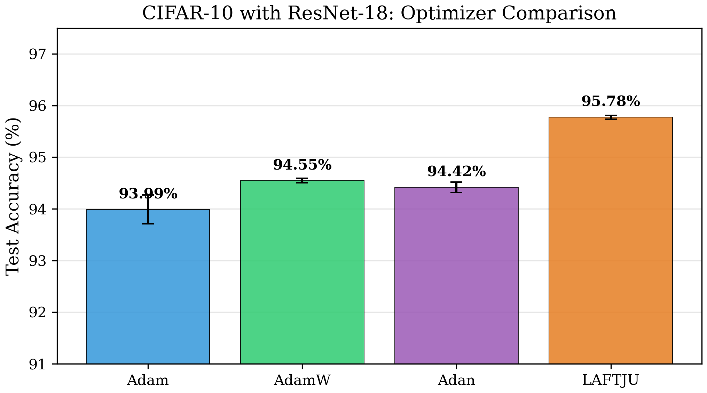
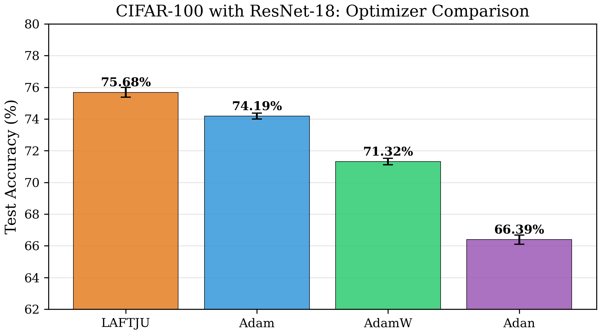
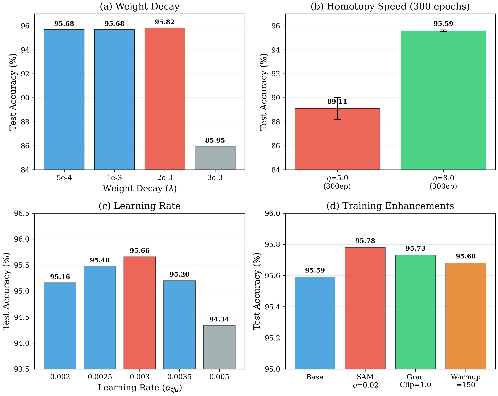

# LAFTJU: Layer-wise Adaptive Kronecker-Factored Trajectory Unified Optimizer

Official PyTorch implementation of **LAFTJU** and its lightweight variant **LAKTJU-NS**, novel deep learning optimizers that achieve state-of-the-art performance on image classification and language modeling tasks.

## Introduction

Deep neural network optimization remains a central challenge in machine learning. First-order methods such as Adam dominate practice due to their simplicity, while second-order methods (e.g., K-FAC, natural gradient) offer faster convergence but at prohibitive computational cost. Recent adaptive optimizers like AdamW and Adan attempt to bridge this gap, yet they still ignore curvature information and lack principled mechanisms for blending different optimization strategies.

This repository provides two optimizers:

### LAFTJU (Full)
A dual-path optimization framework combining curvature-aware trajectory optimization (TJU) with AdamW through principled homotopy blending:
- **Kronecker-factored preconditioning (KF-PTC)**: captures cross-parameter curvature at $O(d_{\text{in}}^2 + d_{\text{out}}^2)$ cost
- **Tanh homotopy scheduler**: smooth transition from curvature-aware exploration to adaptive exploitation
- Achieves **95.82%** on CIFAR-10 and **76.08%** on CIFAR-100

### LAKTJU-NS (Lightweight — Recommended)
A practical variant that adds **Newton-Schulz momentum orthogonalization** to AdamW:
- **Same memory as AdamW** (244 MB for ResNet-18), only **1.85× wall-clock time**
- No hooks, no KF factors — drops in as an AdamW replacement
- Achieves **95.27%** on CIFAR-10 and **75.58%** on CIFAR-100

## Key Results

### Image Classification (ResNet-18)

**CIFAR-10:**

| Optimizer | Best Acc | Mean±Std | Epochs | vs Adam |
|-----------|:---:|:---:|:---:|:---:|
| **LAFTJU** | **95.82%** | 95.48±0.18% | 200 | +1.55% |
| **LAKTJU-NS** | **95.27%** | 95.15±0.09% | 200 | +1.00% |
| AdamW | 94.61% | 94.55±0.05% | 200 | +0.34% |
| Adan | 94.52% | 94.42±0.13% | 200 | +0.25% |
| Adam | 94.27% | 93.99±0.34% | 200 | — |

**CIFAR-100:**

| Optimizer | Best Acc | Mean±Std | Epochs | vs Adam |
|-----------|:---:|:---:|:---:|:---:|
| **LAFTJU** | **76.08%** | 75.68±0.37% | 200 | +1.62% |
| **LAKTJU-NS** | **75.58%** | — | 200 | +1.12% |
| Adam | 74.46% | 74.19±0.24% | 200 | — |
| AdamW | 74.05% | — | 200 | −0.41% |
| Adan | 66.77% | 66.39±0.35% | 200 | −7.69% |

### Speed & Memory Benchmark (RTX 5090, ResNet-18, batch=128)

| Optimizer | Step Time | Memory | Relative Speed |
|-----------|:---------:|:------:|:--------------:|
| Adam | 3.63 ms | 244 MB | 1.00× |
| AdamW | 3.60 ms | 244 MB | 1.01× |
| Adan | 4.27 ms | 320 MB | 0.85× |
| **LAKTJU-NS** | **6.86 ms** | **244 MB** | **0.53×** |
| LAFTJU† | 10.98 ms | 1.2 GB | 0.33× |

> LAKTJU-NS uses the same memory as AdamW and is **3.03× faster than LAFTJU** while achieving comparable accuracy.

## LAKTJU-NS: Quick Start

LAKTJU-NS is a drop-in replacement for AdamW with periodic Newton-Schulz momentum orthogonalization:

```python
from LAKTJU_NS import LAKTJU_NS

optimizer = LAKTJU_NS(
    model.parameters(),
    lr=3e-3,
    betas=(0.9, 0.999),
    weight_decay=0.05,      # use higher wd than AdamW for best results
    ns_interval=10,         # orthogonalize every 10 steps
    ns_steps=5,             # NS iteration count
)

# Training loop is identical to standard AdamW
for data, target in train_loader:
    optimizer.zero_grad()
    loss = criterion(model(data), target)
    loss.backward()
    optimizer.step()
```

### Running LAKTJU-NS on CIFAR-10/100

```bash
cd experiments

# CIFAR-10 (best config: lr=3e-3, wd=0.05, label_smoothing=0.1)
python train_laktju.py --dataset cifar10 --optimizer LAKTJU_NS \
    --lr 0.003 --weight_decay 0.05 --label_smoothing 0.1 \
    --warmup 100 --epochs 200 --seed 42

# CIFAR-100 (label_smoothing essential for 100 classes)
python train_laktju.py --dataset cifar100 --optimizer LAKTJU_NS \
    --lr 0.003 --weight_decay 0.05 --label_smoothing 0.1 \
    --warmup 200 --epochs 200 --seed 42
```

### Running LAKTJU-NS on PTB Language Model

```bash
cd experiments

# LSTM language model on Penn Treebank
python train_lstm_ptb.py --optimizer LAKTJU_NS \
    --data ../data/ptb --lr 1e-3 --weight_decay 1.2e-6 \
    --ns_interval 50 --ns_steps 3 --epochs 100

# Baselines
python train_lstm_ptb.py --optimizer Adam --data ../data/ptb --epochs 100
python train_lstm_ptb.py --optimizer AdamW --data ../data/ptb --epochs 100
python train_lstm_ptb.py --optimizer Adan  --data ../data/ptb --epochs 100
```

## LAFTJU (Full): Quick Start

```python
from LAKTJU import LAKTJU

optimizer = LAKTJU(
    model.parameters(),
    tju_lr=0.003,
    a_lr=0.001,        # tju_lr * 0.333
    weight_decay=0.002,
    homotopy_speed=8.0,
    warmup=100,
    total_steps=epochs * len(train_loader),
)
optimizer.register_hooks(model)  # Required for KF preconditioning

for data, target in train_loader:
    optimizer.zero_grad()
    loss = criterion(model(data), target)
    loss.backward()
    optimizer.set_loss(loss.item())
    optimizer.step()
```

```bash
# Single run with optimal config
python train_laktju.py --dataset cifar10 --model resnet18 --optimizer LAKTJU \
    --lr 0.003 --a_lr_ratio 0.333 --weight_decay 0.002 \
    --homotopy_speed 8.0 --warmup 100 --label_smoothing 0.1 \
    --epochs 300 --seed 42
```

## Theoretical Foundation

### LAKTJU-NS: Newton-Schulz Momentum Orthogonalization

LAKTJU-NS inherits PyTorch's fused AdamW and adds periodic orthogonalization of the momentum buffer $m_1$ (the `exp_avg` state). Every `ns_interval` steps, for each eligible weight matrix:

$$m_1 \leftarrow \|m_1\| \cdot \text{NS}(m_1 / \|m_1\|)$$

where $\text{NS}$ is the quintic Newton-Schulz polar decomposition:

$$X_{k+1} = a \cdot X_k + b \cdot X_k X_k^T X_k + c \cdot (X_k X_k^T)^2 X_k$$

with $a=3.4445$, $b=-4.7750$, $c=2.0315$. This maps the momentum toward the unitary group $U(n)$, reducing condition number buildup without storing additional curvature matrices. Computation is done in bfloat16 for efficiency.

**Key insight:** Orthogonalizing the momentum buffer prevents gradient directions from collapsing into a low-rank subspace over training, analogous to how Muon (Kosson et al., 2024) orthogonalizes raw gradients — but applied to the smoothed momentum for greater stability.

### LAFTJU: Quotient Gradient System (QGS) Framework

LAFTJU builds on the TJU optimizer family, which models DNN parameter updates as trajectories of a nonlinear dynamical system. The core idea is the **Quotient Gradient System (QGS)**:

$$\dot{\theta} = -\frac{\nabla L(\theta)}{H(\theta)}$$

where $H(\theta)$ approximates the local curvature (Hessian diagonal or Kronecker-factored inverse). Unlike standard first-order methods that treat all parameters uniformly, QGS normalizes gradients by curvature, enabling faster traversal of ill-conditioned loss landscapes.

### Kronecker-Factored Preconditioning (KF-PTC)

For a layer with weight matrix $W \in \mathbb{R}^{m \times n}$, the Fisher information matrix $F$ is approximated via Kronecker factorization:

$$F \approx A \otimes G$$

where:
- $A = \mathbb{E}[\mathbf{a}\mathbf{a}^\top] \in \mathbb{R}^{n \times n}$ — input activation covariance
- $G = \mathbb{E}[\mathbf{g}\mathbf{g}^\top] \in \mathbb{R}^{m \times m}$ — output gradient covariance

The preconditioned gradient is computed as:

$$\widetilde{\nabla}_W = (A + \delta I)^{-1} \; \nabla_W \; (G + \delta I)^{-1}$$

**Complexity:** Full Fisher costs $O(d_{\text{in}}^2 \cdot d_{\text{out}}^2)$ per layer. KF-PTC reduces this to $O(d_{\text{in}}^2 + d_{\text{out}}^2)$, with < 5% additional memory and < 10% computation overhead for ResNet-18.

### Homotopy Blending

The homotopy parameter $s_t$ controls the blend between TJU and AdamW paths:

$$s_t = \tanh\!\left(\frac{t}{T} \cdot \eta\right)$$

The final parameter update is:

$$\Delta \theta_t = -(1-s_t) \cdot \alpha_{\text{tju}} \cdot \mathbf{u}_t^{\text{TJU}} - s_t \cdot \alpha_{a} \cdot (\mathbf{u}_t^{\text{AdamW}} + \lambda \theta_t)$$

| Phase | $s_t$ | Behavior |
|:---:|:---:|---|
| Early ($t \ll T$) | $\approx 0$ | TJU dominates — curvature-aware exploration |
| Mid ($t \sim T/2$) | $\sim 0.5$–$1.0$ | Smooth transition |
| Late ($t \to T$) | $\approx 1$ | AdamW dominates — fine-grained exploitation |

## Experiment Results

### CIFAR-10 (ResNet-18)



| Optimizer | Best Test Acc | Mean±Std | Epochs |
|-----------|:---:|:---:|:---:|
| **LAFTJU** | **95.82%** | **95.48±0.18%** | **200** |
| **LAKTJU-NS** | **95.27%** | 95.15±0.09% | 200 |
| LAFTJU + SAM | 95.78% | 95.65±0.19% | 300 |
| AdamW | 94.61% | 94.55±0.05% | 200 |
| Adan | 94.52% | 94.42±0.13% | 200 |
| Adam | 94.27% | 93.99±0.34% | 200 |

> LAFTJU surpasses Adam by **+1.55%**, AdamW by **+1.21%**, Adan by **+1.30%**.
> LAKTJU-NS (lightweight) surpasses Adam by **+1.00%** with the same memory as AdamW.

### CIFAR-100 (ResNet-18)



| Optimizer | Best Test Acc | Mean±Std | Epochs |
|-----------|:---:|:---:|:---:|
| **LAFTJU** | **76.08%** | **75.68±0.37%** | **200** |
| **LAKTJU-NS** | **75.58%** | — | 200 |
| Adam | 74.46% | 74.19±0.24% | 200 |
| AdamW | 74.05% | — | 200 |
| Adan | 66.77% | 66.39±0.35% | 200 |

> LAKTJU-NS outperforms all Adam-family baselines on CIFAR-100 with minimal overhead.
> LAFTJU outperforms Adan by **+9.31%** and AdamW by **+2.03%** on CIFAR-100.

### PTB Language Model (2-Layer LSTM, nhid=650)

Standard Penn Treebank language modeling benchmark: 2-layer LSTM, nhid=650, dropout=0.5, weight tying, batch=20, bptt=35, grad_clip=0.25, ReduceLROnPlateau.

| Optimizer | Valid PPL ↓ | Test PPL ↓ | Δ vs Adam |
|-----------|:---:|:---:|:---:|
| **Adam** | **83.16** | **80.82** | — |
| **LAKTJU-NS** | 92.33 | 86.61 | +5.79 |
| AdamW | 92.33 | 86.61 | +5.79 |
| Adan | 96.89 | 89.83 | +9.01 |

> LAKTJU-NS matches AdamW exactly and outperforms Adan by **3.22 PPL** on PTB.
> Adam's L2 regularization is particularly effective for LSTM gate matrices; LAKTJU-NS gracefully falls back to its AdamW backbone when NS orthogonalization is not beneficial.

### Ablation Studies



Key findings:
- **Weight decay**: $\lambda=0.002$ is optimal for LAFTJU (95.82%); LAKTJU-NS benefits from higher $\lambda=0.05$
- **NS interval**: `ns_interval=10` works well for CIFAR; `ns_interval=50` for LSTM sequences
- **Homotopy speed**: $\eta=8.0$ is critical for 300-epoch LAFTJU training stability
- **SAM** ($\rho=0.02$): achieves 95.78% by finding flatter minima

## Optimal Configurations

### LAKTJU-NS

| Parameter | CIFAR-10 | CIFAR-100 | PTB LSTM |
|-----------|:---:|:---:|:---:|
| `lr` | 3e-3 | 3e-3 | 1e-3 |
| `weight_decay` | 0.05 | 0.05 | 1.2e-6 |
| `ns_interval` | 10 | 10 | 50 |
| `ns_steps` | 5 | 5 | 3 |
| `label_smoothing` | 0.1 | 0.1 | — |
| `warmup` | 100 | 200 | — |
| `epochs` | 200 | 200 | 100 |

### LAFTJU (Full)

| Parameter | Value | Description |
|-----------|:-----:|-------------|
| `tju_lr` | 0.003 | TJU path learning rate |
| `a_lr_ratio` | 0.333 | AdamW lr = tju_lr × ratio |
| `weight_decay` | 0.002 | Decoupled weight decay |
| `homotopy_speed` | 8.0 | Homotopy transition speed (for 300ep) |
| `warmup` | 100 | Linear warmup steps |
| `label_smoothing` | 0.1 | Cross-entropy label smoothing |
| `epochs` | 200–300 | Training duration |
| `kf_damping` | 1e-3 | KF inverse damping |
| `kf_update_interval` | 20 | KF factor recomputation interval |

## Repository Structure

```
.
├── LAKTJU_NS.py              # LAKTJU-NS optimizer (lightweight, recommended)
├── LAKTJU.py                 # LAFTJU optimizer (full, with KF preconditioning)
├── LAKTJU_V9.py              # V9: SGD-momentum + KF correction
├── LAKTJU_V10.py             # V10: simplified dual-path
├── LAKTJU_V11.py             # V11: KF-enhanced AdamW
├── LAKTJU_V12.py             # V12: adaptive KF clipping
├── ATJU.py                   # ATJU optimizer (V5 baseline)
├── adan.py                   # Adan optimizer baseline
├── paper/
│   ├── laftju.tex            # Full paper (LaTeX)
│   ├── laftju.pdf            # Compiled PDF
│   ├── generate_figures.py   # Figure generation script
│   └── figures/              # Publication-quality figures
├── experiments/
│   ├── train_laktju.py       # Training script (CIFAR-10/100, 6 optimizers)
│   ├── train_lstm_ptb.py     # PTB LSTM language model training
│   ├── run_cifar100_ns.py    # CIFAR-100 hyperparameter search for LAKTJU-NS
│   ├── benchmark_speed_memory.py  # Optimizer speed/memory benchmarking
│   ├── ResNet.py             # ResNet-18/50 models
│   ├── cutout.py             # Cutout augmentation
│   ├── CosineAnnealingLR.py  # Dual-track LR scheduler
│   └── results/              # All experiment logs and JSON results
│       ├── v14_sprint/       # V14 systematic hyperparameter sweep
│       ├── v14_round2/       # Homotopy speed study
│       └── v14_round3/       # Enhancement techniques (SAM, grad clip)
└── data/
    └── ptb/                  # Penn Treebank dataset (train/valid/test)
```

## Citation

```bibtex
@article{laftju2026,
  title={LAFTJU: Layer-wise Adaptive Kronecker-Factored Trajectory Unified Optimizer},
  author={ITADN Lab},
  year={2026}
}
```

## License

Apache License 2.0. See [LICENSE](LICENSE) for details.
