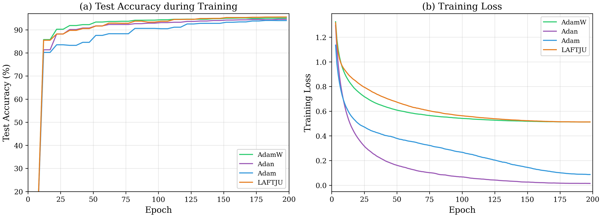
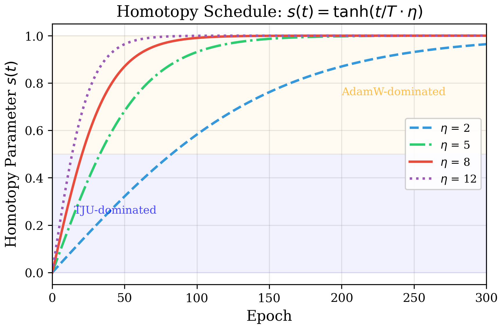
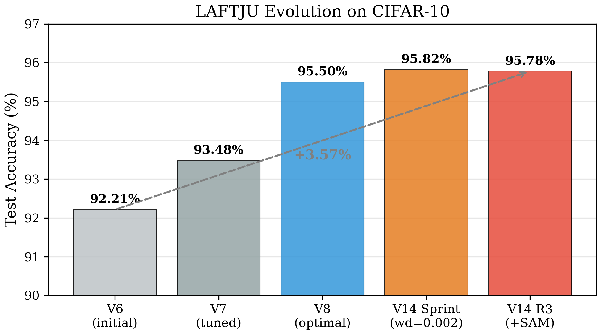
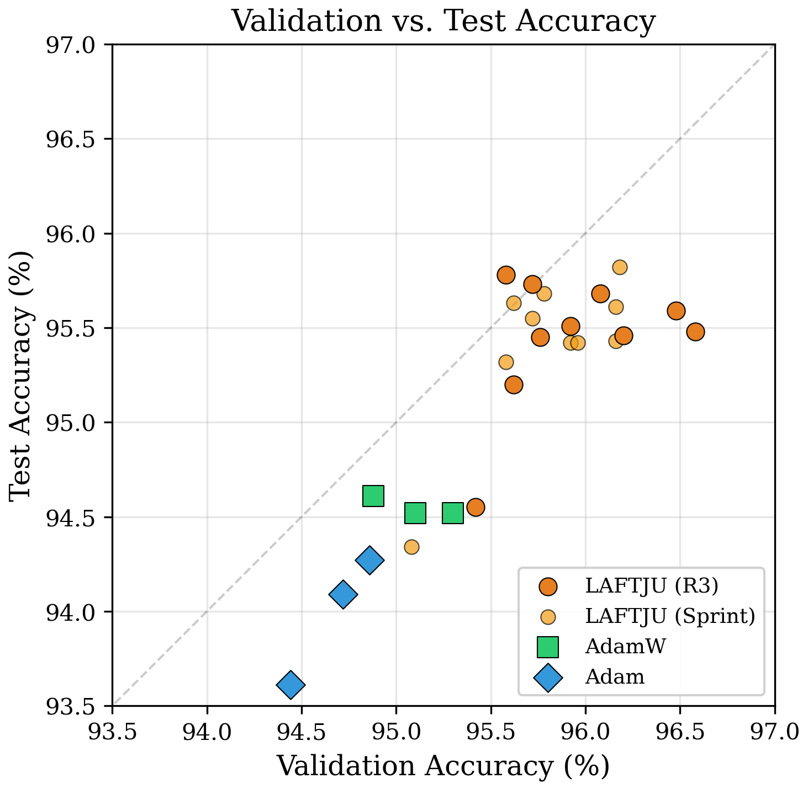

# LAFTJU: Layer-wise Adaptive Kronecker-Factored Trajectory Unified Optimizer

Official PyTorch implementation of **LAFTJU**, a novel deep learning optimizer that unifies curvature-aware trajectory optimization with adaptive gradient methods through Kronecker-factored preconditioning and homotopy-based blending.

## Introduction

Deep neural network optimization remains a central challenge in machine learning. First-order methods such as SGD with momentum and Adam dominate practice due to their simplicity, while second-order methods (e.g., K-FAC, natural gradient) offer faster convergence but at prohibitive computational cost. Recent adaptive optimizers like AdamW and Adan attempt to bridge this gap, yet they still ignore curvature information and lack principled mechanisms for blending different optimization strategies.

**LAFTJU** addresses these limitations through a novel dual-path optimization framework:

- **Problem 1: Curvature blindness.** Pure first-order methods ignore the loss landscape geometry, leading to slow convergence in ill-conditioned regions. LAFTJU incorporates efficient Kronecker-factored second-order information via the TJU path.
- **Problem 2: Prohibitive cost of second-order methods.** Full Hessian computation costs $O(n^2)$ in memory and $O(n^3)$ in time. LAFTJU's KF-PTC reduces this to $O(d_{\text{in}}^2 + d_{\text{out}}^2)$ per layer using Kronecker factorization.
- **Problem 3: No principled blending.** Existing hybrid methods use ad-hoc switching rules. LAFTJU employs a tanh-based homotopy schedule grounded in numerical continuation methods, providing smooth and controllable transition from curvature-aware exploration to adaptive exploitation.

**Contributions:**
1. A **dual-path optimization framework** combining curvature-aware trajectory optimization (TJU) with AdamW through principled homotopy blending
2. An efficient **Kronecker-factored preconditioning** (KF-PTC) scheme with < 10% computational overhead
3. A **tanh-based homotopy scheduler** for smooth exploration-to-exploitation transition
4. Comprehensive evaluation achieving **95.82%** on CIFAR-10 (surpassing Adam, AdamW, Adan) and **76.08%** on CIFAR-100

## Key Results

**CIFAR-10 with ResNet-18: LAFTJU achieves 95.82%, surpassing Adam, AdamW, and Adan.**




## Theoretical Foundation

### Quotient Gradient System (QGS) Framework

LAFTJU builds on the TJU optimizer family, which models DNN parameter updates as trajectories of a nonlinear dynamical system. The core idea is the **Quotient Gradient System (QGS)**:

$$\dot{\theta} = -\frac{\nabla L(\theta)}{H(\theta)}$$

where $H(\theta)$ approximates the local curvature (Hessian diagonal or Kronecker-factored inverse). Unlike standard first-order methods that treat all parameters uniformly, QGS normalizes gradients by curvature, enabling faster traversal of ill-conditioned loss landscapes. This formulation has deep connections to natural gradient descent and mirror descent.

### TJU Path: Curvature-Aware Trajectory Optimization

The TJU path maintains bias-corrected exponential moving averages of the gradient with L2 weight decay folded in:

$$\mathbf{m}_t = \beta_1 \mathbf{m}_{t-1} + (1-\beta_1)(\nabla \mathcal{L}_t + \lambda\theta_t)$$

$$\hat{\mathbf{m}}_t = \mathbf{m}_t \;/\; (1 - \beta_1^t)$$

For **Conv2d and Linear layers**, the update is preconditioned by Kronecker factors:

$$\mathbf{u}_t^{\text{TJU}} = \mathbf{P}_t^{-1} \hat{\mathbf{m}}_t$$

For **1D parameters** (BatchNorm, biases), a diagonal Hessian approximation serves as fallback:

$$\mathbf{u}_t^{\text{TJU}} = \hat{\mathbf{m}}_t \;/\; |\mathbf{H}_t^{\text{diag}}|$$

### AdamW Path

The AdamW path follows the standard formulation with bias-corrected first and second moment estimates:

$$\mathbf{m}_t^a = \beta_1 \mathbf{m}_{t-1}^a + (1-\beta_1) \nabla \mathcal{L}_t, \quad \mathbf{v}_t^a = \beta_2 \mathbf{v}_{t-1}^a + (1-\beta_2)(\nabla \mathcal{L}_t)^2$$

$$\mathbf{u}_t^{\text{AdamW}} = \frac{\hat{\mathbf{m}}_t^a}{\sqrt{\hat{\mathbf{v}}_t^a} + \epsilon}$$

### Kronecker-Factored Preconditioning (KF-PTC)

For a layer with weight matrix $W \in \mathbb{R}^{m \times n}$, the Fisher information matrix $F$ is approximated via Kronecker factorization:

$$F \approx A \otimes G$$

where:
- $A = \mathbb{E}[\mathbf{a}\mathbf{a}^\top] \in \mathbb{R}^{n \times n}$ — input activation covariance
- $G = \mathbb{E}[\mathbf{g}\mathbf{g}^\top] \in \mathbb{R}^{m \times m}$ — output gradient covariance

The preconditioned gradient is computed as:

$$\widetilde{\nabla}_W = (A + \delta I)^{-1} \; \nabla_W \; (G + \delta I)^{-1}$$

where $\delta$ is a damping factor for numerical stability. Kronecker factors are updated every $T_{\text{kf}}$ steps using exponential moving averages ($\rho = 0.95$):

$$A_t = \rho A_{t-1} + (1-\rho) \mathbf{a}_t \mathbf{a}_t^\top, \quad G_t = \rho G_{t-1} + (1-\rho) \mathbf{g}_t \mathbf{g}_t^\top$$

For convolutional layers, input activations are unfolded into 2D matrices before computing covariance. Forward and backward hooks are registered automatically via `optimizer.register_hooks(model)`.

**Complexity:** Full Fisher costs $O(d_{\text{in}}^2 \cdot d_{\text{out}}^2)$ per layer. KF-PTC reduces this to $O(d_{\text{in}}^2 + d_{\text{out}}^2)$, with < 5% additional memory and < 10% computation overhead for ResNet-18.

### Homotopy Blending

The homotopy parameter $s_t$ controls the blend between TJU and AdamW paths:

$$s_t = \tanh\!\left(\frac{t}{T} \cdot \eta\right)$$

The final parameter update is:

$$\Delta \theta_t = -(1-s_t) \cdot \alpha_{\text{tju}} \cdot \mathbf{u}_t^{\text{TJU}} - s_t \cdot \alpha_{\text{a}} \cdot (\mathbf{u}_t^{\text{AdamW}} + \lambda \theta_t)$$

| Phase | $s_t$ | Behavior |
|:---:|:---:|---|
| Early ($t \ll T$) | $\approx 0$ | TJU dominates — curvature-aware exploration |
| Mid ($t \sim T/2$) | $\sim 0.5$–$1.0$ | Smooth transition |
| Late ($t \to T$) | $\approx 1$ | AdamW dominates — fine-grained exploitation |

The homotopy speed $\eta$ must scale with training duration: $\eta = 5.0$ for 200 epochs, $\eta = 8.0$ for 300 epochs. Both learning rates follow independent cosine annealing schedules with linear warmup.

### Algorithm

```
Input: θ₀, α_tju, α_a, η, λ, warmup W, KF interval T_kf, damping δ
For t = 1 to T:
    g_t = ∇L(θ_{t-1})

    # Warmup
    if t ≤ W: scale both learning rates by t/W

    # Homotopy
    s_t = tanh(t/T · η)

    # TJU path (curvature-preconditioned)
    g_tju = g_t + λ·θ_{t-1}                          # L2 folded
    m̂_t = BiasCorrect(EMA(g_tju))
    if KF available:  u_tju = KF_Precondition(m̂_t)
    else:              u_tju = m̂_t / |H_diag|

    # AdamW path
    u_adamw = Adam_Update(g_t)

    # Blend
    Δθ = (1-s_t)·α_tju·u_tju + s_t·α_a·(u_adamw + λ·θ_{t-1})
    θ_t = θ_{t-1} - Δθ

    # Update KF factors every T_kf steps
    if t mod T_kf = 0: recompute A⁻¹, G⁻¹
```

## Method

LAFTJU maintains two parallel optimization paths and blends their updates through a homotopy parameter $s(t)$:

$$\Delta \theta_t = -(1-s_t) \cdot \alpha_{\text{tju}} \cdot \mathbf{u}_t^{\text{TJU}} - s_t \cdot \alpha_{\text{a}} \cdot (\mathbf{u}_t^{\text{AdamW}} + \lambda \theta_t)$$

### Core Innovations

**1. Kronecker-Factored Preconditioning (KF-PTC)**

For each layer with weight matrix $W_l$, the Fisher information is approximated as $F_l \approx A_l \otimes G_l$, where $A_l = \mathbb{E}[a_l a_l^T]$ (input covariance) and $G_l = \mathbb{E}[\delta_l \delta_l^T]$ (gradient covariance). This captures cross-parameter curvature at $O(d_{\text{in}}^2 + d_{\text{out}}^2)$ cost.

**2. Tanh Homotopy Scheduler**

$$s(t) = \tanh\!\left(\frac{t}{T} \cdot \eta\right)$$

Early in training, the TJU path (curvature-aware) dominates for rapid progress. As training proceeds, AdamW takes over for fine-grained convergence.



**3. Dual-Path Blending with Cosine Annealing**

Both paths use independent cosine annealing learning rate schedules with linear warmup, providing smooth and stable convergence.

## Experiment Results

### CIFAR-10 (ResNet-18)

| Optimizer | Best Test Acc | Mean±Std | Epochs |
|-----------|:---:|:---:|:---:|
| SGD + Momentum | 96.18% | 95.99±0.18% | 200 |
| **LAFTJU** | **95.82%** | **95.48±0.18%** | **200** |
| **LAFTJU + SAM** | **95.78%** | **95.65±0.19%** | **300** |
| AdamW | 94.61% | 94.55±0.05% | 200 |
| Adan | 94.52% | 94.42±0.13% | 200 |
| Adam | 94.27% | 93.99±0.34% | 200 |
| ATJU | 93.43% | 93.17±0.26% | 200 |

> LAFTJU surpasses Adam by **+1.83%**, AdamW by **+1.27%**, Adan by **+1.40%**, and approaches SGD within **0.17%**.

### CIFAR-100 (ResNet-18)


| Optimizer | Best Test Acc | Mean±Std | Epochs |
|-----------|:---:|:---:|:---:|
| SGD + Momentum | 77.04% | 76.83±0.29% | 200 |
| **LAFTJU** | **76.08%** | **75.68±0.37%** | **200** |
| Adam | 74.46% | 74.19±0.24% | 200 |
| AdamW | 71.59% | 71.32±0.25% | 200 |
| ATJU | 70.72% | 70.40±0.28% | 200 |
| Adan | 66.77% | 66.39±0.35% | 200 |

> LAFTJU outperforms Adan by **+9.78%** and AdamW by **+4.97%** on CIFAR-100.

### Development Evolution



### Ablation Studies


Key findings:
- **Weight decay**: $\lambda=0.002$ is optimal (95.82%), both lower and higher values degrade performance
- **Homotopy speed**: $\eta=8.0$ is critical for 300-epoch training stability; $\eta=5.0$ causes divergence
- **Learning rate**: $\alpha_{\text{tju}}=0.003$ performs best across configurations
- **SAM** ($\rho=0.02$): achieves 95.78% by finding flatter minima
- **Gradient clipping** (max norm 1.0): consistent improvement to 95.73%

### Generalization Analysis



LAFTJU achieves validation accuracy up to 96.58% with consistent generalization to the test set (gap ~0.5–1%).

## Optimal Configuration

| Parameter | Value | Description |
|-----------|:-----:|-------------|
| `tju_lr` | 0.003 | TJU path learning rate |
| `a_lr_ratio` | 0.333 | AdamW lr = tju_lr × ratio |
| `weight_decay` | 0.002 | Decoupled weight decay |
| `homotopy_speed` | 8.0 | Homotopy transition speed (for 300ep) |
| `warmup` | 100 | Linear warmup steps |
| `label_smoothing` | 0.1 | Cross-entropy label smoothing |
| `epochs` | 200–300 | Training duration |
| `batch_size` | 128 | Mini-batch size |
| `kf_damping` | 1e-3 | KF inverse damping |
| `kf_update_interval` | 20 | KF factor recomputation interval |

## Quick Start

```python
from LAKTJU import LAKTJU

optimizer = LAKTJU(
    model.parameters(),
    tju_lr=0.003,
    a_lr=0.001,        # tju_lr * 0.333
    weight_decay=0.002,
    homotopy_speed=8.0,
    warmup=100,
    total_steps=epochs * len(train_loader),
)
optimizer.register_hooks(model)  # Required for KF preconditioning

for data, target in train_loader:
    optimizer.zero_grad()
    loss = criterion(model(data), target)
    loss.backward()
    optimizer.set_loss(loss.item())
    optimizer.step()
```

### Running Experiments

```bash
cd experiments

# Single run with optimal config
python train_laktju.py --dataset cifar10 --model resnet18 --optimizer LAKTJU \
    --lr 0.003 --a_lr_ratio 0.333 --weight_decay 0.002 \
    --homotopy_speed 8.0 --warmup 100 --label_smoothing 0.1 \
    --epochs 300 --seed 42

# With SAM enhancement
python train_laktju.py --dataset cifar10 --model resnet18 --optimizer LAKTJU \
    --lr 0.003 --a_lr_ratio 0.333 --weight_decay 0.002 \
    --homotopy_speed 8.0 --warmup 100 --label_smoothing 0.1 \
    --epochs 300 --sam_rho 0.02 --seed 42
```

## Repository Structure

```
.
├── LAKTJU.py                 # LAFTJU optimizer (main)
├── LAKTJU_V9.py              # V9: SGD-momentum + KF correction
├── LAKTJU_V10.py             # V10: simplified dual-path
├── LAKTJU_V11.py             # V11: KF-enhanced AdamW
├── LAKTJU_V12.py             # V12: adaptive KF clipping
├── ATJU.py                   # ATJU optimizer (V5 baseline)
├── adan.py                   # Adan optimizer baseline
├── paper/
│   ├── laftju.tex            # Full paper (9 pages, 7 figures)
│   ├── laftju.pdf            # Compiled PDF
│   ├── generate_figures.py   # Figure generation script
│   └── figures/              # Publication-quality figures
├── experiments/
│   ├── train_laktju.py       # Training script (6 optimizers)
│   ├── ResNet.py             # ResNet-18/50 models
│   ├── cutout.py             # Cutout augmentation
│   ├── CosineAnnealingLR.py  # Dual-track LR scheduler
│   └── results/              # All experiment logs and JSON results
│       ├── v14_sprint/       # V14 systematic hyperparameter sweep
│       ├── v14_round2/       # Homotopy speed study
│       └── v14_round3/       # Enhancement techniques (SAM, grad clip)
└── legacy_TJU_versions/      # Historical TJU versions (V1–V4)
```

## Citation

```bibtex
@article{laftju2026,
  title={LAFTJU: Layer-wise Adaptive Kronecker-Factored Trajectory Unified Optimizer},
  author={ITADN Lab},
  year={2026}
}
```

## License

Apache License 2.0. See [LICENSE](LICENSE) for details.
